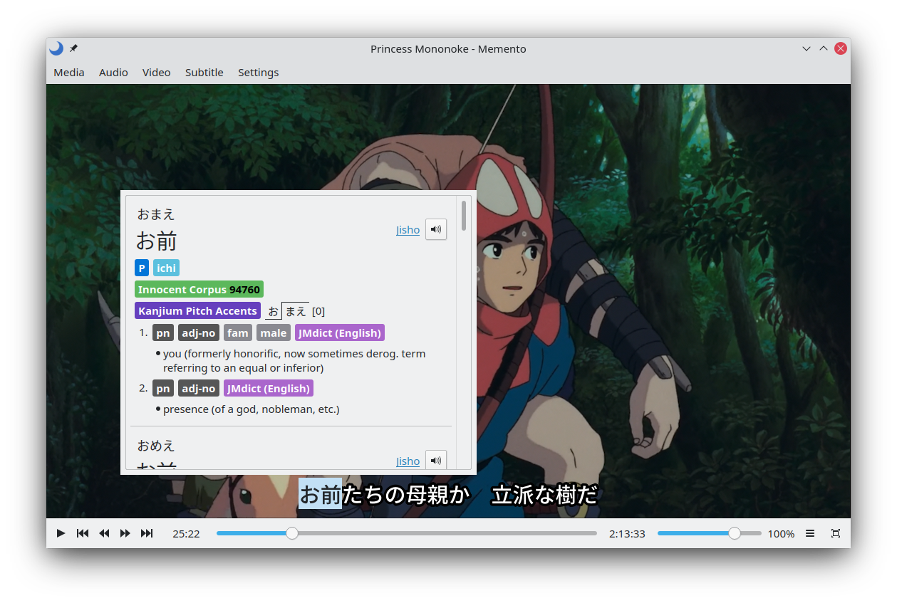

# Memento

[](https://aur.archlinux.org/packages/memento/)
[](https://flathub.org/apps/details/io.github.ripose_jp.Memento)

Memento is a FOSS, mpv-based video player for studying Japanese.



## Features

* Grammar aware subtitle search
* Yomichan-style Kanji cards
* Support for Yomichan dictionaries
* Anki card creation through [AnkiConnect](https://ankiweb.net/shared/info/2055492159)
* Support for mpv upscalers, plugins, and configuration files

## Dictionaries

*   **[JMdict](https://www.edrdg.org/jmdict/edict_doc.html)** (Japanese vocabulary)
    *   [JMdict\_dutch.zip](https://github.com/themoeway/jmdict-yomitan/releases/latest/download/JMdict_dutch.zip)
    *   [JMdict\_english.zip](https://github.com/themoeway/jmdict-yomitan/releases/latest/download/JMdict_english.zip)
    *   [JMdict\_french.zip](https://github.com/themoeway/jmdict-yomitan/releases/latest/download/JMdict_french.zip)
    *   [JMdict\_german.zip](https://github.com/themoeway/jmdict-yomitan/releases/latest/download/JMdict_german.zip)
    *   [JMdict\_hungarian.zip](https://github.com/themoeway/jmdict-yomitan/releases/latest/download/JMdict_hungarian.zip)
    *   [JMdict\_russian.zip](https://github.com/themoeway/jmdict-yomitan/releases/latest/download/JMdict_russian.zip)
    *   [JMdict\_slovenian.zip](https://github.com/themoeway/jmdict-yomitan/releases/latest/download/JMdict_slovenian.zip)
    *   [JMdict\_spanish.zip](https://github.com/themoeway/jmdict-yomitan/releases/latest/download/JMdict_spanish.zip)
    *   [JMdict\_swedish.zip](https://github.com/themoeway/jmdict-yomitan/releases/latest/download/JMdict_swedish.zip)
*   **[JMnedict](https://www.edrdg.org/enamdict/enamdict_doc.html)** (Japanese names)
    *   [JMnedict.zip](https://github.com/themoeway/jmdict-yomitan/releases/latest/download/JMnedict.zip)
*   **[KireiCake](https://kireicake.com/rikaicakes/)** (Japanese slang)
    *   [kireicake.zip](https://github.com/FooSoft/yomichan/raw/dictionaries/kireicake.zip)
*   **[KANJIDIC](http://nihongo.monash.edu/kanjidic2/index.html)** (Japanese kanji)
    *   [KANJIDIC\_english.zip](https://github.com/themoeway/jmdict-yomitan/releases/latest/download/KANJIDIC_english.zip)
    *   [KANJIDIC\_french.zip](https://github.com/themoeway/jmdict-yomitan/releases/latest/download/KANJIDIC_french.zip)
    *   [KANJIDIC\_portuguese.zip](https://github.com/themoeway/jmdict-yomitan/releases/latest/download/KANJIDIC_portuguese.zip)
    *   [KANJIDIC\_spanish.zip](https://github.com/themoeway/jmdict-yomitan/releases/latest/download/KANJIDIC_spanish.zip)
*   **[Innocent Corpus](https://web.archive.org/web/20190309073023/https://forum.koohii.com/thread-9459.html#pid168613)** (Term and kanji frequencies across 5000+ novels)
    *   [innocent\_corpus.zip](https://github.com/FooSoft/yomichan/raw/dictionaries/innocent_corpus.zip)
*   **[Kanjium](https://github.com/mifunetoshiro/kanjium)** (Pitch dictionary, see [related project page](https://github.com/toasted-nutbread/yomichan-pitch-accent-dictionary) for details)
    *   [kanjium_pitch_accents.zip](https://github.com/FooSoft/yomichan/raw/dictionaries/kanjium_pitch_accents.zip)

## Troubleshooting

### Can't Add Cards: Only the "Show in Anki" Button is Available

This means there is a mistake in your card template.
When this happens, AnkiConnect will report that all potential cards are not addable.
Double check your card template to see if the front of the card is missing something.

### Secondary Subtitles Don't Work

Prior to mpv v0.35.0, it was impossible to set the visibility of primary and
secondary subtitles independent of one another.
If you haven't compiled Memento yourself and are using the provided binaries for
v1.0.0 or later, this section doesn't apply to you.

#### Method 1

Go to Settings → Options → Search, uncheck "Hide mpv subtitles when subtitle
search is visible", and check "Hide subtitle search when playing media".

If the searchable subtitles become harder to read, consider adding a background.
This can be done in Interface settings.
Make sure you set the alpha/opacity channel to 255 in order to avoid your
background being transparent.

#### Method 2

When the Memento is paused, manually toggle subtitle visibility to reveal the
secondary subtitle.
Subtitle visibility is bound to **v** by default.

### Windows: MSVCR100.dll is Missing When Trying to Stream

This error can be fixed by installing the
[Microsoft Visual C++ 2010 Service Pack 1 Redistributable Package (x86)](https://download.microsoft.com/download/1/6/5/165255E7-1014-4D0A-B094-B6A430A6BFFC/vcredist_x86.exe).

### Windows: Updating youtube-dl/yt-dlp

If you're version of youtube-dl is out of date, you may experience degraded streaming performance or websites not working entirely.

Memento's version of youtube-dl can be updated by doing the following:

1. Download [yt-dlp](https://github.com/yt-dlp/yt-dlp/releases/latest/download/yt-dlp.exe)
2. Rename the file to `youtube-dl.exe`
3. Put `youtube-dl.exe` in Memento's install directory. For the portable version of Memento, this is located in the same folder as the executable. For the installed version, this is located at `C:\Program Files\Memento` by default.

### macOS: Streaming video doesn't work

This means that mpv cannot find your youtube-dl installation.

To install youtube-dl, paste these commands into Terminal:
```
curl -L https://github.com/yt-dlp/yt-dlp/releases/latest/download/yt-dlp -o ~/Library/Preferences/memento/youtube-dl
chmod a+rx ~/Library/Preferences/memento/youtube-dl
```

### macOS: Could not initialize MeCab

Move the Memento application to a directory that doesn't have spaces in the path
like `/Applications`. Unfortunately, this is an limitation of MeCab and there is
no workaround that can be implemented.

### Linux: Audio and images aren't added to Anki

*This only applies to users of the **Anki** Flatpak.*

By default the **Anki** Flatpak doesn't have access to the `/tmp` directory.
Memento stores audio and image files here temporarily when making them available to Anki.
You can give Anki access to the `/tmp` directory by installing [Flatseal](https://flathub.org/apps/com.github.tchx84.Flatseal).
To do so, open Flatseal, select Anki, and add the `/tmp` directory under **Other files**.

## Dependencies

* Qt
    * Base
    * SVG
* mpv
* sqlite3
* Json-C
* libzip
* youtube-dl or yt-dlp (optional)
* MeCab (optional)
    * With either ipadic or NAIST-jdic installed as a system dictionary on Linux and macOS. This only applies to self-compiled versions, not appimages or app bundles.
* Python (optional)

For the best experience, install [Noto Sans JP](https://fonts.google.com/noto/specimen/Noto+Sans+JP)
and the [Kanji Stroke Order](https://drive.google.com/uc?export=download&id=1oyQoTB531tbhlYaOW7ugvutXZ7HSlJfW) fonts.

## Building

**I do not guarantee that any branch will successfully build or be bug-free.**
**If you want to build a stable version of Memento, compile a [release](https://github.com/ripose-jp/Memento/releases) from source.**

### Linux

To install Memento on Linux, type the following commands:

```
make
sudo make install
```

### Windows

1. Install [MSYS2](https://www.msys2.org/)
1. Open **MSYS2 MinGW 64-bit**
1. Make sure MSYS2 is up to date by running this command multiple times until it stops doing anything:
    ```
    pacman -Syuu
    ```
1. Install the necessary tools and dependencies:
    ```
    pacman -S git make mingw-w64-x86_64-gcc mingw-w64-x86_64-ninja mingw-w64-x86_64-cmake mingw-w64-x86_64-python mingw-w64-x86_64-sqlite3 mingw-w64-x86_64-qt6 mingw-w64-x86_64-mpv mingw-w64-x86_64-mecab mingw-w64-x86_64-json-c mingw-w64-x86_64-libzip
    ```
1. Clone the repository:
    ```
    git clone https://github.com/ripose-jp/Memento.git
    ```
1. Build Memento:
    ```
    cd Memento
    ./windows/build.sh x86_64
    ```
1. The resulting file will be in
    ```
    build/Memento_x86_64
    ```

### macOS

**Important:** Clang is the only officially supported compiler for building Memento on macOS.

1. Install [Homebrew](https://brew.sh/) with this command:
   ```
   /bin/bash -c "$(curl -fsSL https://raw.githubusercontent.com/Homebrew/install/HEAD/install.sh)"
   ```
1. Install the necessary tools and dependencies:
   ```
   brew install git cmake sqlite3 qt6 mpv mecab mecab-ipadic json-c libzip
   ```
1. Clone the repository:
   ```
   git clone https://github.com/ripose-jp/Memento.git
   ```
1. Build Memento:
   ```
   cd Memento
   make
   ```
1. The resulting executable will be:
   ```
   Memento/build/src/Memento
   ```

### macOS App Bundle

1. Follow steps 1 - 3 of the macOS build instructions.

1. `dylibbundler` is also needed when creating an app bundle, so install it with:
```
brew install dylibbundler
```

1. Open the **Keychain Access** app.

1. Go to **Keychain Access** > **Certificate Assistant** > **Create a Certificate...**
   in the menubar.

1. Put the name of your certificate in the 'Name' field, set the 'Certificate Type'
   to 'Code Signing', and click 'Create'.

1. Return to your terminal and input:
    ```
    cd Memento
    make appbundle CERT_NAME='<name entered in the last step>'
    ```

1. The resulting app bundle will located at:
    ```
    Memento/build/src/Memento.app
    ```

### Adding OCR Support

To build with OCR support, make sure that Python is installed and run:
```
pip install manga-ocr
```
*Any problems you may have getting `manga-ocr` installed using `pip` is beyond the scope of this project. I wish you the best of luck.*

Add `-DOCR_SUPPORT=ON` to the `CMAKE_ARGS` environment variable:
```
export CMAKE_ARGS='-DOCR_SUPPORT=ON'
```
From here follow normal build instructions for your platform.

**Note**:
Theoretically OCR is supported on Windows.
Assuming Memento was built against msys2's version of Python, you will have to
set the environment variable `PYTHONHOME` to `C:\msys64\mingw64`.

## Configuration

Most mpv shaders, plugins, and configuration files will work without modification.

It is important to note that mpv and Memento's configuration directories are
**separate**. This means mpv configuration files, scripts, etc. intended to modify
Memento's behavior should be placed in Memento's configuration directory.

The Memento configuration directory is located at:

### Linux
```
~/.config/memento
```

### Windows

Version 0.5.1 and later
```
%APPDATA%\Local\memento
```

Version 0.5.0-1 and earlier
```
[installation directory]\config
```

### macOS
```
~/Library/Preferences/memento
```

If any mpv binds or plugins do not work, please create an issue in the issue
tracker.

## Contributing

Before making a pull request, please read [CONTRIBUTING.md](CONTRIBUTING.md).

## Animebook

If you hate Memento, try [Animebook](https://animebook.github.io/).

https://github.com/animebook/animebook.github.io

## Acknowledgements

* MpvWidget code is based off of libmpv example code by w4m
  * https://github.com/mpv-player/mpv-examples/tree/master/libmpv/qt_opengl
* Some code based off of Baka-MPlayer
  * https://github.com/u8sand/Baka-MPlayer
* Hardware acceleration achieved on Linux using mpc-qt code
  * https://github.com/mpc-qt/mpc-qt
* UI inspired by and dictionaries provided by Yomichan.
  * https://foosoft.net/projects/yomichan/
* OCR backend written kha-white and contributors
  * https://github.com/kha-white/manga-ocr
* Fullscreen icons sourced from here
  * https://www.iconfinder.com/iconsets/material-core
* Various icons sourced from here
  * https://www.iconfinder.com/iconsets/ionicons
* Pause, play, skip, and seek icons sourced from here and used under the [CC 3.0 License](https://creativecommons.org/licenses/by/3.0/)
  * https://www.iconfinder.com/iconsets/play-rounded
* `mingw-bundledlls.py` based on this script with a slightly expanded blacklist
  * https://github.com/mpreisler/mingw-bundledlls
* Flatpak manifest heavily based on the mpv Flatpak
  * https://github.com/flathub/io.mpv.Mpv
