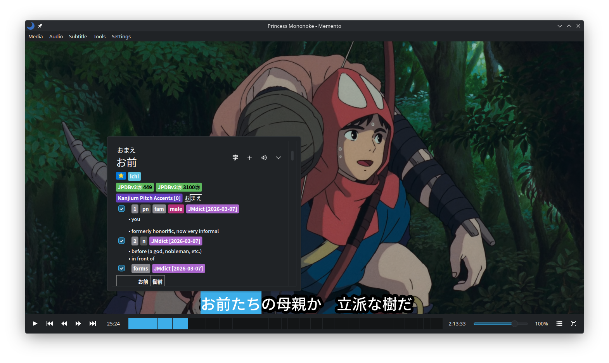

# Memento

[](https://aur.archlinux.org/packages/memento/)
[](https://flathub.org/apps/details/io.github.ripose_jp.Memento)

Memento is a FOSS, mpv-based video player for studying Japanese.

**Memento has been drastically overhauled since v1.7.2. If you're looking**
**for the README relevant to that version, click**
**[here](https://github.com/ripose-jp/Memento/tree/9aa39ec4f6c4c033db68253988ccfc2a9898df78).**



## Features

* Grammar aware subtitle search
* Yomichan-style Kanji cards
* Support for Yomichan dictionaries
* Anki card creation through [AnkiConnect](https://ankiweb.net/shared/info/2055492159)
* Support for mpv upscalers, plugins, and configuration files

## Dictionaries

* [JMdict](https://github.com/yomidevs/jmdict-yomitan/) (English)
  * [JMdict_english_with_examples.zip](https://github.com/yomidevs/jmdict-yomitan/releases/latest/download/JMdict_english_with_examples.zip)
    * This is the version of JMdict with example sentences from the [Tatoeba Project](http://tatoeba.org/home).
  * [JMdict_english.zip](https://github.com/yomidevs/jmdict-yomitan/releases/latest/download/JMdict_english.zip)
    * This is the same JMdict but without example sentences.
  * [JMdict_english_legacy.zip](https://github.com/yomidevs/jmdict-yomitan/releases/latest/download/JMdict_english_legacy.zip)
    * This is the same JMdict with legacy formatting instead of structured content.
  * [JMdict_english_without_proper_names.zip](https://github.com/yomidevs/jmdict-yomitan/releases/latest/download/JMdict_english_without_proper_names.zip)
    * This is `JMdict_english` but without several thousand entries from JMnedict.
  * [JMdict_english_legacy_without_proper_names.zip](https://github.com/yomidevs/jmdict-yomitan/releases/latest/download/JMdict_english_legacy_without_proper_names.zip)
* [JMdict](https://github.com/yomidevs/jmdict-yomitan/) (Other Languages)
  * [JMdict_dutch.zip](https://github.com/yomidevs/jmdict-yomitan/releases/latest/download/JMdict_dutch.zip)
  * [JMdict_french.zip](https://github.com/yomidevs/jmdict-yomitan/releases/latest/download/JMdict_french.zip)
  * [JMdict_german.zip](https://github.com/yomidevs/jmdict-yomitan/releases/latest/download/JMdict_german.zip)
  * [JMdict_hungarian.zip](https://github.com/yomidevs/jmdict-yomitan/releases/latest/download/JMdict_hungarian.zip)
  * [JMdict_russian.zip](https://github.com/yomidevs/jmdict-yomitan/releases/latest/download/JMdict_russian.zip)
  * [JMdict_slovenian.zip](https://github.com/yomidevs/jmdict-yomitan/releases/latest/download/JMdict_slovenian.zip)
  * [JMdict_spanish.zip](https://github.com/yomidevs/jmdict-yomitan/releases/latest/download/JMdict_spanish.zip)
  * [JMdict_swedish.zip](https://github.com/yomidevs/jmdict-yomitan/releases/latest/download/JMdict_swedish.zip)
* [Jitendex](https://jitendex.org/) (English)
  * [jitendex-yomitan.zip](https://github.com/stephenmk/stephenmk.github.io/releases/latest/download/jitendex-yomitan.zip)
    * Similar to `JMdict_english_with_examples` with additional formatting.
* [JMnedict](https://github.com/yomidevs/jmdict-yomitan/) (Japanese Names)
  * [JMnedict.zip](https://github.com/yomidevs/jmdict-yomitan/releases/latest/download/JMnedict.zip)
* [JPDB](https://github.com/Kuuuube/yomitan-dictionaries) (Frequency)
  * [JPDB v2.2 Kana](https://github.com/Kuuuube/yomitan-dictionaries/raw/main/dictionaries/JPDB_v2.2_Frequency_Kana_2024-10-13.zip) (Recommended)
  * [JPDB v2.2 Frequency Kana Display Only](https://github.com/Kuuuube/yomitan-dictionaries/raw/main/dictionaries/JPDB_v2.2_Frequency_Kana_Display_Only_2024-10-13.zip)
  * [JPDB v2.2](https://github.com/Kuuuube/yomitan-dictionaries/raw/main/dictionaries/JPDB_v2.2_Frequency_2024-10-13.zip)
* [BCCWJ SUW LUW Combined](https://github.com/Kuuuube/yomitan-dictionaries) (Frequency)
  * [BCCWJ_SUW_LUW_combined.zip](https://github.com/Kuuuube/yomitan-dictionaries/raw/main/dictionaries/BCCWJ_SUW_LUW_combined.zip)
* Kanjium (Pitch)
  * [kanjium_pitch_accents.zip](https://github.com/FooSoft/yomichan/raw/dictionaries/kanjium_pitch_accents.zip)
* [KANJIDIC](https://github.com/yomidevs/jmdict-yomitan/) (Kanji)
  * [KANJIDIC_english.zip](https://github.com/yomidevs/jmdict-yomitan/releases/latest/download/KANJIDIC_english.zip)
  * [KANJIDIC_french.zip](https://github.com/yomidevs/jmdict-yomitan/releases/latest/download/KANJIDIC_french.zip)
  * [KANJIDIC_portuguese.zip](https://github.com/yomidevs/jmdict-yomitan/releases/latest/download/KANJIDIC_portuguese.zip)
  * [KANJIDIC_spanish.zip](https://github.com/yomidevs/jmdict-yomitan/releases/latest/download/KANJIDIC_spanish.zip)

## Troubleshooting

### Can't Add Cards: Only the "Show in Anki" Button is Available

This means there is a mistake in your card template.
When this happens, AnkiConnect will report that all potential cards are not addable.
Double check your card template to see if the front of the card is missing something.

### Windows: Updating yt-dlp

If you're version of yt-dlp is out of date, you may experience degraded streaming performance or websites not working entirely.

Memento's version of yt-dlp can be updated by doing the following:

1. Download [yt-dlp](https://github.com/yt-dlp/yt-dlp/releases/latest/download/yt-dlp.exe)
1. Put `yt-dlp.exe` in Memento's install directory. For the portable version of Memento, this is located in the same folder as the executable. For the installed version, this is located at `C:\Program Files\Memento` by default.

### macOS: Streaming video doesn't work

This means that mpv cannot find your yt-dlp installation.

To install yt-dlp, paste these commands into Terminal:
```
curl -L https://github.com/yt-dlp/yt-dlp/releases/latest/download/yt-dlp -o ~/Library/Preferences/memento/yt-dlp
chmod a+rx ~/Library/Preferences/memento/yt-dlp
```

### macOS: Could not initialize MeCab

Move the Memento application to a directory that doesn't have spaces in the path
like `/Applications`. Unfortunately, this is an limitation of MeCab and there is
no workaround that can be implemented.

### KDE Plasma: No native file picker

For Memento to be able to use the native file picker on KDE Plasma, you must
compile with with `-DMEMENTO_QAPPLICATION=ON`.
This pulls in a dependency on Qt Widgets, so make sure to have that installed on
your system.

## Dependencies

* Qt
    * Base
    * SVG
* mpv
* sqlite3
* Json-C
* libzip
* QCoro (optional)
    * Use `-DMEMENTO_SYSTEM_QCORO=ON`
* yt-dlp (optional)
* MeCab (optional)
    * Use `-DMEMENTO_MECAB_SUPPORT=ON`
    * With either ipadic or NAIST-jdic installed as a system dictionary on Linux and macOS.
* [libmocr](https://github.com/ripose-jp/libmocr) (Optional)
    * Use `-DMEMENTO_OCR_SUPPORT=ON` and `-DMEMENTO_SYSTEM_MOCR=ON`

For the best experience, install [Noto Sans CJK JP](https://github.com/googlefonts/noto-cjk/raw/main/Sans/Variable/TTF/NotoSansCJKjp-VF.ttf)
and the [Kanji Stroke Order](https://drive.google.com/uc?export=download&id=1oyQoTB531tbhlYaOW7ugvutXZ7HSlJfW) fonts.


## Building

**I do not guarantee that any branch will successfully build or be bug-free.**
**If you want to build a stable version of Memento, compile a [release](https://github.com/ripose-jp/Memento/releases) from source.**

### Linux

To install Memento on Linux, type the following commands:

```
mkdir build
cd build
cmake -DCMAKE_BUILD_TYPE=Release ..
cmake --build . -j $(nproc)
sudo cmake --build . --target install
```

### Windows

1. Install [MSYS2](https://www.msys2.org/)
1. Open **MSYS2 UCRT64**
1. Make sure MSYS2 is up to date by running this command multiple times until it stops doing anything:
   ```
   pacman -Syu
   ```
1. Install the necessary tools and dependencies:
   ```
   pacman -S mingw-w64-ucrt-x86_64-git mingw-w64-ucrt-x86_64-gcc mingw-w64-ucrt-x86_64-ninja mingw-w64-ucrt-x86_64-cmake mingw-w64-ucrt-x86_64-python mingw-w64-ucrt-x86_64-sqlite3 mingw-w64-ucrt-x86_64-qt6 mingw-w64-ucrt-x86_64-mpv mingw-w64-ucrt-x86_64-mecab mingw-w64-ucrt-x86_64-json-c mingw-w64-ucrt-x86_64-libzip
   ```
1. Clone the repository:
   ```
   git clone https://github.com/ripose-jp/Memento.git
   ```
1. Build Memento:
   ```
   cd Memento
   ./windows/build.sh -DCMAKE_BUILD_TYPE=Release
   ```
1. The resulting file will be in
   ```
   build/Memento_x86_64
   ```

### macOS

**Important:** Clang is the only officially supported compiler for building Memento on macOS.

1. Install [Homebrew](https://brew.sh/) with this command:
   ```
   /bin/bash -c "$(curl -fsSL https://raw.githubusercontent.com/Homebrew/install/HEAD/install.sh)"
   ```
1. Install the necessary tools and dependencies:
   ```
   brew install git cmake sqlite3 qt6 qcoro6 mpv mecab mecab-ipadic json-c libzip
   ```
1. Clone the repository:
   ```
   git clone https://github.com/ripose-jp/Memento.git
   ```
1. Build Memento:
   ```
   cd Memento
   mkdir build
   cd build
   cmake -DCMAKE_BUILD_TYPE=Release ..
   cmake --build . -j $(nproc)
   ```
1. The resulting executable will be:
   ```
   Memento/build/src/memento
   ```

### macOS Bundle

1. Follow steps 1 - 3 of the macOS build instructions.
1. Open the **Keychain Access** app.
1. Go to **Keychain Access** > **Certificate Assistant** >
   **Create a Certificate...** in the menubar.
1. Put the name of your certificate in the 'Name' field, set the
   'Certificate Type' to 'Code Signing', and click 'Create'.
1. Return to your terminal and input:
    ```
    cd Memento
    mkdir build
    cd build
    cmake -DMEMENTO_CODESIGN_IDENTITY="<certificate name>" -DMEMENTO_BUNDLE=ON -DCMAKE_BUILD_TYPE=Release -DMEMENTO_MECAB_SUPPORT=ON -DMEMENTO_SYSTEM_QCORO=ON ..
    cmake --build . --target memento_bundle -j$(sysctl -n hw.ncpu)
    ```
1. The resulting app bundle will located at:
    ```
    Memento/build/src/Memento.app
    ```

### Adding OCR Support

To build with OCR support, make sure that Python is installed and run:
```
pip install manga-ocr
```
*Any problems you may have getting `manga-ocr` installed using `pip` is beyond the scope of this project.*
*I wish you the best of luck.*

Configure the build with:
```
cmake .. -DMEMENTO_OCR_SUPPORT=ON
```

If you want to use a venv, make sure to configure the build with these additional options:
```
-DPython_EXECUTABLE=/path/to/.venv/bin/python
-DPython_FIND_VIRTUALENV=ONLY
```

**Note:** If using `-DMEMENTO_SYSTEM_MOCR=ON`, make sure that the installed libmocr binary links to your preferred venv by building libmocr using the same `-DPython_` options.

Follow the normal build instructions from here.

## Configuration

Most mpv shaders, plugins, and configuration files will work without modification.

It is important to note that mpv and Memento's configuration directories are
**separate**. This means mpv configuration files, scripts, etc. intended to modify
Memento's behavior should be placed in Memento's configuration directory.

The Memento configuration directory is located at:

### Linux

```
~/.config/memento
```

### Windows

```
%APPDATA%\Local\memento
```

### macOS

```
~/Library/Preferences/memento
```

If any mpv binds or plugins do not work, please create an issue in the issue
tracker.

## asbplayer

If you hate Memento, try [asbplayer](https://app.asbplayer.dev/).

## Acknowledgements

* MpvWidget code is based off of libmpv example code
  * https://github.com/mpv-player/mpv-examples/tree/master/libmpv/qml
* Some code based off of Baka-MPlayer
  * https://github.com/u8sand/Baka-MPlayer
* UI inspired by Yomichan
  * https://github.com/FooSoft/yomichan
* Icons sourced from Google Material Symbols and Icons
  * https://fonts.google.com/icons
* OCR backend written kha-white and contributors
  * https://github.com/kha-white/manga-ocr
* `mingw-bundledlls.py` based on this script with a slightly expanded blacklist
  * https://github.com/mpreisler/mingw-bundledlls
* Flatpak manifest heavily based on the mpv Flatpak
  * https://github.com/flathub/io.mpv.Mpv
* QCoro is builtin to the project
  * https://github.com/qcoro/qcoro
* Most dictionary links taken from jmdict-yomitan and yomitan-dictionaries
  * https://github.com/yomidevs/jmdict-yomitan
  * https://github.com/Kuuuube/yomitan-dictionaries
